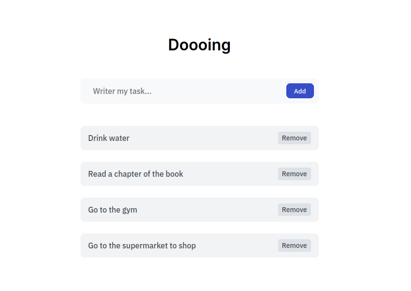

# To-Do List

Este é um projeto de uma lista de tarefas simples, onde você pode adicionar, remover e visualizar as suas tarefas. O projeto usa JavaScript, HTML e CSS para criar a interface e a lógica da aplicação. Além disso, o projeto usa o localStorage para armazenar os dados das tarefas, de forma que elas não se percam ao recarregar a página.

## Como usar

Para usar o projeto, você precisa clonar ou baixar este repositório e abrir o arquivo `index.html` no seu navegador. Você verá uma tela com um campo de texto, um botão e uma área vazia. Para adicionar uma tarefa, digite a descrição da tarefa no campo de texto e clique no botão. A tarefa será adicionada à área abaixo, com um botão para removê-la. Para remover uma tarefa, clique no botão correspondente. As tarefas serão salvas no localStorage e serão carregadas novamente ao abrir a página.

## Tecnologias usadas

- JavaScript: para criar a lógica da aplicação, manipular o DOM e interagir com o localStorage.
- HTML: para criar a estrutura da página e os elementos da interface.
- CSS: para estilizar a página e os elementos da interface.

## Imagem da aplicação

Aqui está uma imagem da aplicação em funcionamento:

